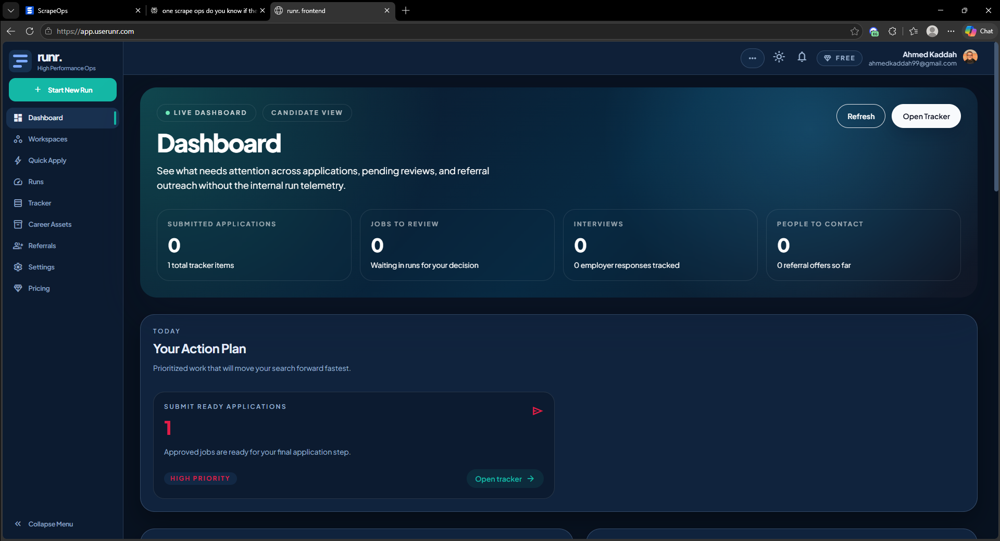

# Remaining App Issues

Use this file to track issues that prevent Runr from working at its fullest extent.

## Issue Template

Copy the rendered block below for each issue.

---

## Issue: Short Title

**Status:** Open

**Priority:** High / Medium / Low

**Area:** Frontend / Backend / Billing / Auth / Deployment / Data / Other

**Environment:** Local / Render / Mobile / Desktop / Other

**URL or screen:** Where this happens

**What happens:**

Describe the current behavior.

**What should happen:**

Describe the expected behavior.

**Steps to reproduce:**

1. Step one
2. Step two
3. Step three

**Screenshots:**

**Notes / clues:**

Errors, logs, suspected cause, related commits, or other clues.

**Fix idea:**

Optional possible solution.

---

## Issues

<!-- Add issues below this line. -->

## Issue #1: Dashboard Takes 30s to Load

**Status:** Open

**Priority:** High

**Area:** Frontend / Backend / Data

**Environment:** Render / Desktop

**URL or screen:** Where this happens

**What happens:**

I click on https://app.userunr.com/ to open the tool and the first thing that loads is the dahsboard and takes a long time to load. also something is wrong because there is no data and it takes a long time to load.

Also it keeps refreshing every few second and still takes a lot of time.chATA

**What should happen:**

Should Load in few seconds and not take this long. or atleast load some parts while the others parts are still loading.

**Steps to reproduce:**

1. Step one
2. Step two
3. Step three

**Screenshots:**

**Notes / clues:**

Errors, logs, suspected cause, related commits, or other clues.

**Fix idea:**

Optional possible solution.

## Issue: Short Title

**Status:** Open

**Priority:** High / Medium / Low

**Area:** Frontend / Backend / Billing / Auth / Deployment / Data / Other

**Environment:** Local / Render / Mobile / Desktop / Other

**URL or screen:** Where this happens

**What happens:**

Describe the current behavior.

**What should happen:**

Describe the expected behavior.

**Steps to reproduce:**

1. Step one
2. Step two
3. Step three

**Screenshots:**

**Notes / clues:**

Errors, logs, suspected cause, related commits, or other clues.

**Fix idea:**

Optional possible solution.

## Issue: Short Title

**Status:** Open

**Priority:** High / Medium / Low

**Area:** Frontend / Backend / Billing / Auth / Deployment / Data / Other

**Environment:** Local / Render / Mobile / Desktop / Other

**URL or screen:** Where this happens

**What happens:**

Describe the current behavior.

**What should happen:**

Describe the expected behavior.

**Steps to reproduce:**

1. Step one
2. Step two
3. Step three

**Screenshots:**

**Notes / clues:**

Errors, logs, suspected cause, related commits, or other clues.

**Fix idea:**

Optional possible solution.

## Issue: Short Title

**Status:** Open

**Priority:** High / Medium / Low

**Area:** Frontend / Backend / Billing / Auth / Deployment / Data / Other

**Environment:** Local / Render / Mobile / Desktop / Other

**URL or screen:** Where this happens

**What happens:**

Describe the current behavior.

**What should happen:**

Describe the expected behavior.

**Steps to reproduce:**

1. Step one
2. Step two
3. Step three

**Screenshots:**

**Notes / clues:**

Errors, logs, suspected cause, related commits, or other clues.

**Fix idea:**

Optional possible solution.

## Issue: Short Title

**Status:** Open

**Priority:** High / Medium / Low

**Area:** Frontend / Backend / Billing / Auth / Deployment / Data / Other

**Environment:** Local / Render / Mobile / Desktop / Other

**URL or screen:** Where this happens

**What happens:**

Describe the current behavior.

**What should happen:**

Describe the expected behavior.

**Steps to reproduce:**

1. Step one
2. Step two
3. Step three

**Screenshots:**

**Notes / clues:**

Errors, logs, suspected cause, related commits, or other clues.

**Fix idea:**

Optional possible solution.

## Issue: Short Title

**Status:** Open

**Priority:** High / Medium / Low

**Area:** Frontend / Backend / Billing / Auth / Deployment / Data / Other

**Environment:** Local / Render / Mobile / Desktop / Other

**URL or screen:** Where this happens

**What happens:**

Describe the current behavior.

**What should happen:**

Describe the expected behavior.

**Steps to reproduce:**

1. Step one
2. Step two
3. Step three

**Screenshots:**

**Notes / clues:**

Errors, logs, suspected cause, related commits, or other clues.

**Fix idea:**

Optional possible solution.

## Issue: Short Title

**Status:** Open

**Priority:** High / Medium / Low

**Area:** Frontend / Backend / Billing / Auth / Deployment / Data / Other

**Environment:** Local / Render / Mobile / Desktop / Other

**URL or screen:** Where this happens

**What happens:**

Describe the current behavior.

**What should happen:**

Describe the expected behavior.

**Steps to reproduce:**

1. Step one
2. Step two
3. Step three

**Screenshots:**

**Notes / clues:**

Errors, logs, suspected cause, related commits, or other clues.

**Fix idea:**

Optional possible solution.

## Issue: Short Title

**Status:** Open

**Priority:** High / Medium / Low

**Area:** Frontend / Backend / Billing / Auth / Deployment / Data / Other

**Environment:** Local / Render / Mobile / Desktop / Other

**URL or screen:** Where this happens

**What happens:**

Describe the current behavior.

**What should happen:**

Describe the expected behavior.

**Steps to reproduce:**

1. Step one
2. Step two
3. Step three

**Screenshots:**

**Notes / clues:**

Errors, logs, suspected cause, related commits, or other clues.

**Fix idea:**

Optional possible solution.

## Issue: Short Title

**Status:** Open

**Priority:** High / Medium / Low

**Area:** Frontend / Backend / Billing / Auth / Deployment / Data / Other

**Environment:** Local / Render / Mobile / Desktop / Other

**URL or screen:** Where this happens

**What happens:**

Describe the current behavior.

**What should happen:**

Describe the expected behavior.

**Steps to reproduce:**

1. Step one
2. Step two
3. Step three

**Screenshots:**

**Notes / clues:**

Errors, logs, suspected cause, related commits, or other clues.

**Fix idea:**

Optional possible solution.

## Issue: Short Title

**Status:** Open

**Priority:** High / Medium / Low

**Area:** Frontend / Backend / Billing / Auth / Deployment / Data / Other

**Environment:** Local / Render / Mobile / Desktop / Other

**URL or screen:** Where this happens

**What happens:**

Describe the current behavior.

**What should happen:**

Describe the expected behavior.

**Steps to reproduce:**

1. Step one
2. Step two
3. Step three

**Screenshots:**

**Notes / clues:**

Errors, logs, suspected cause, related commits, or other clues.

**Fix idea:**

Optional possible solution.

## Issue: Short Title

**Status:** Open

**Priority:** High / Medium / Low

**Area:** Frontend / Backend / Billing / Auth / Deployment / Data / Other

**Environment:** Local / Render / Mobile / Desktop / Other

**URL or screen:** Where this happens

**What happens:**

Describe the current behavior.

**What should happen:**

Describe the expected behavior.

**Steps to reproduce:**

1. Step one
2. Step two
3. Step three

**Screenshots:**

**Notes / clues:**

Errors, logs, suspected cause, related commits, or other clues.

**Fix idea:**

Optional possible solution.

## Issue: Short Title

**Status:** Open

**Priority:** High / Medium / Low

**Area:** Frontend / Backend / Billing / Auth / Deployment / Data / Other

**Environment:** Local / Render / Mobile / Desktop / Other

**URL or screen:** Where this happens

**What happens:**

Describe the current behavior.

**What should happen:**

Describe the expected behavior.

**Steps to reproduce:**

1. Step one
2. Step two
3. Step three

**Screenshots:**

**Notes / clues:**

Errors, logs, suspected cause, related commits, or other clues.

**Fix idea:**

Optional possible solution.